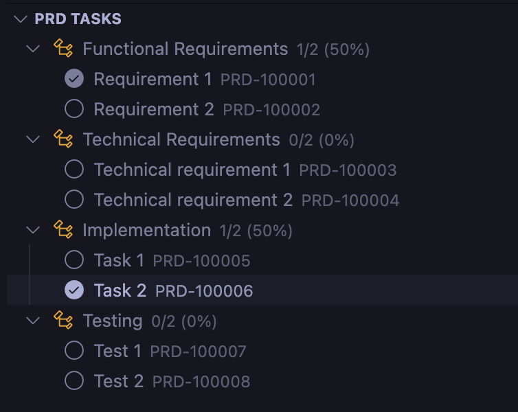

# PRD Assistant - VSCode Extension

Transform your Product Requirements Documents into interactive, trackable project dashboards.

## 📸 Screenshots

### PRD Explorer Tree View


The PRD Explorer provides a hierarchical view of all your tasks organized by headers, with completion percentages and progress indicators.

### CodeLens Integration


Inline CodeLens actions let you interact with tasks directly in the editor - toggle completion, assign users, copy IDs, and view statistics.

## 🎯 Features

### ✅ Interactive Task Management

Turn your markdown task lists into interactive checkboxes with automatic progress tracking.

- Click checkboxes to toggle completion status
- Automatic task ID generation (PRD-XXXXXX format)
- Visual progress indicators
- Nested task support with hierarchy tracking
- Convert regular list items to tasks with one click

### 👥 Smart Task Assignment

Assign tasks to team members with @-mention syntax.

- Syntax: `@username` for clear ownership
- Visual highlighting of assignees
- Bulk assignment capabilities
- Track workload by team member

### 🔗 Deep Linking System

Reference any task anywhere with automatic deep links.

- Every task gets a unique ID (e.g., PRD-123456)
- Click any PRD-XXXXXX reference to jump to that task
- Copy shareable links with one click

### 📊 Visual Progress Tracking

Get instant visibility into project progress with multiple views.

- Tree view explorer in sidebar with task hierarchy
- Inline CodeLens statistics and actions
- Progress reports with completion percentages
- Real-time updates as you work
- Export progress reports to CSV/JSON formats

### 🎨 Enhanced Editing Experience

- **CodeLens Actions**: Toggle tasks, assign users, copy IDs directly from the editor
- **Quick Fixes**: Automatically resolve duplicate task IDs
- **Format on Save**: Normalize checkbox formatting automatically
- **Conversion Tools**: Convert list items to tasks in bulk or individually
- **Tree View**: Organize tasks by headers with filtering options

## 📋 Requirements

- Visual Studio Code 1.100.0 or higher

## 🚀 Getting Started

### Installation from Marketplace

1. Open VSCode
2. Go to Extensions (Ctrl+Shift+X)
3. Search for "PRD Assistant"
4. Click Install

### First Use

1. **Create a PRD file**: Use the "Create Empty PRD File" button in the PRD Explorer or create any `.md` file with "PRD" in the name
2. **Add tasks**: Write tasks using markdown syntax:

   ```markdown
   # My Project

   ## Tasks

   - [ ] Complete user authentication PRD-100001
   - [ ] Design database schema @john PRD-100002
   - [ ] Implement API endpoints PRD-100003
   ```

3. **Interactive features**: Click checkboxes, use CodeLens actions, and view progress in the PRD Explorer

### Supported File Patterns

By default, PRD Assistant activates for files matching:

- `*prd*.md`
- `PRD*.md`
- `*PRD*.md`

You can also configure additional files in settings.

## 💻 Development Guide

### Development Workflow

1. **Launch Extension Development Host**

   - Press `F5` in VSCode
   - This opens a new "Extension Development Host" window
   - Your extension is pre-installed in this window

2. **Making Changes**

   - Edit source files in `src/`
   - Use `npm run watch` for auto-compilation
   - Reload with "Developer: Reload Window" (Ctrl+Shift+P)

3. **Testing**
   - Create test PRD.md files
   - Test checkboxes, assignments, deep links
   - Check the PRD Explorer view

### Available Scripts

```bash
# Development
npm run compile     # Build TypeScript
npm run watch       # Watch mode for development
npm run lint        # Run ESLint
npm run test        # Run tests

# Packaging & Publishing
npm run package     # Create .vsix file for testing
npm run package:pre # Create pre-release .vsix
npm run build:prod  # Clean, compile, and package

# Publishing (requires vsce login)
npm run publish       # Publish current version
npm run publish:patch # Bump patch version and publish
npm run publish:minor # Bump minor version and publish
npm run publish:major # Bump major version and publish

# Utilities
npm run clean       # Remove build artifacts
```

### Project Structure

```
prd-assistant/
├── src/
│   ├── extension.ts                           # Main extension entry point
│   ├── managers/
│   │   └── prdTaskManager.ts                  # Core task management logic
│   ├── models/
│   │   ├── task.ts                            # Task data models
│   │   └── treeNode.ts                        # Tree view models
│   ├── providers/
│   │   ├── prdTreeProvider.ts                 # Sidebar tree view
│   │   ├── prdCodeLensProvider.ts             # Inline actions
│   │   ├── prdDecorationProvider.ts           # Text decorations
│   │   ├── prdDocumentLinkProvider.ts         # Deep linking
│   │   ├── prdQuickFixProvider.ts             # Auto-fixes
│   │   └── prdConversionCodeLensProvider.ts   # List conversion
│   ├── utils/
│   │   └── prdUtils.ts                        # Utility functions
│   └── test/
│       └── extension.test.ts                  # Test suite
├── syntaxes/
│   └── prd.tmLanguage.json                    # Syntax highlighting
├── images/                                    # Extension icons
├── package.json                               # Extension manifest
└── README.md                                  # This file
```

## ⚙️ Extension Settings

Configure PRD Assistant through VSCode settings:

### Core Settings

- `prdAssistant.autoGenerateIds`: Automatically generate task IDs (default: `true`)
- `prdAssistant.taskIdPrefix`: Prefix for generated task IDs (default: `"PRD"`)
- `prdAssistant.idFormat`: ID generation strategy - `"sequential"` or `"timestamp"` (default: `"sequential"`)

### Display Settings

- `prdAssistant.showCodeLens`: Show inline task actions (default: `true`)
- `prdAssistant.enableCodeLensForHeaders`: Show stats and 'Add Task' on headers (default: `true`)
- `prdAssistant.enableCodeLensForTasks`: Show action buttons on tasks (default: `true`)
- `prdAssistant.enableConversionCodeLens`: Show 'Convert to Task' on list items (default: `true`)
- `prdAssistant.showProgressInTreeView`: Display completion percentages (default: `true`)

### File Detection

- `prdAssistant.filePatterns`: File patterns to identify PRD files (default: `["*prd*.md", "PRD*.md", "*PRD*.md"]`)
- `prdAssistant.additionalFiles`: Specific files to enhance with PRD features (default: `[]`)
  - Example: `["CLAUDE.md", "TODO.md", "TASKS.md"]`

### Behavior Settings

- `prdAssistant.normalizeCheckboxes`: Auto-fix checkbox formatting on save (default: `true`)
- `prdAssistant.autoProcessDocuments`: Auto-process PRD files when opened (default: `true`)
- `prdAssistant.showDuplicateWarnings`: Show warnings for duplicate task IDs (default: `true`)
- `prdAssistant.enableQuickFixes`: Enable auto-fixes for duplicates (default: `true`)

### Visual Enhancement

- `prdAssistant.decorateAssignees`: Highlight @-mentions (default: `true`)
- `prdAssistant.decorateDeepLinks`: Make task IDs clickable (default: `true`)
- `prdAssistant.enableDecorations`: Enable visual decorations (default: `true`)

## 🔧 Key Features Explained

### Task ID Generation

- **Sequential**: PRD-100001, PRD-100002, etc. (recommended)
- **Timestamp**: Based on current timestamp for uniqueness
- **Smart Collision Avoidance**: Automatically detects existing IDs

### CodeLens Actions

- **On Headers**: View completion stats, add tasks
- **On Tasks**: Toggle completion, assign users, copy IDs
- **On List Items**: Convert to tasks with auto-generated IDs

### Tree View Features

- **Hierarchical Display**: Tasks organized by headers
- **Progress Indicators**: Completion percentages
- **Filtering**: Show all, completed, or uncompleted tasks
- **Multi-file Support**: Handle multiple PRD files in workspace

### Checkbox Normalization

Automatically fixes common checkbox formatting issues:

- `[]` → `[ ]` (adds space for empty checkbox)
- `[x ]`, `[ x]`, `[ x ]` → `[x]` (normalizes checked checkbox)

## 🐛 Known Issues

- Task IDs might regenerate if file is edited outside VSCode
- Large files (>1000 tasks) may have performance impact
- Deep links only work within the same workspace

## 📝 Release Notes

### 1.0.0 - Initial Release

- ✅ Interactive checkbox functionality
- 🆔 Automatic task ID generation with collision avoidance
- 👥 Task assignment with @-mentions
- 🔗 Deep linking between tasks
- 📊 Progress tracking and reporting
- 🎨 Syntax highlighting for PRD files
- 🌳 Tree view explorer with hierarchy
- 📋 CodeLens integration for inline actions
- 🔄 List item to task conversion
- 📤 CSV/JSON export functionality
- 🔧 Quick fixes for duplicate IDs
- ⚡ Auto-format checkbox normalization

## 🤝 Contributing

We welcome contributions! Please see our [Contributing Guide](CONTRIBUTING.md) for details.

1. Fork the repository
2. Create your feature branch (`git checkout -b feature/AmazingFeature`)
3. Commit your changes (`git commit -m 'Add some AmazingFeature'`)
4. Push to the branch (`git push origin feature/AmazingFeature`)
5. Open a Pull Request

## 📄 License

This project is licensed under the MIT License - see the [LICENSE](LICENSE) file for details.

## 🙋‍♀️ Support

- **Issues**: [GitHub Issues](https://github.com/fusepilot/prd-assistant-vscode/issues)
- **Documentation**: Check this README and the extension's built-in help
